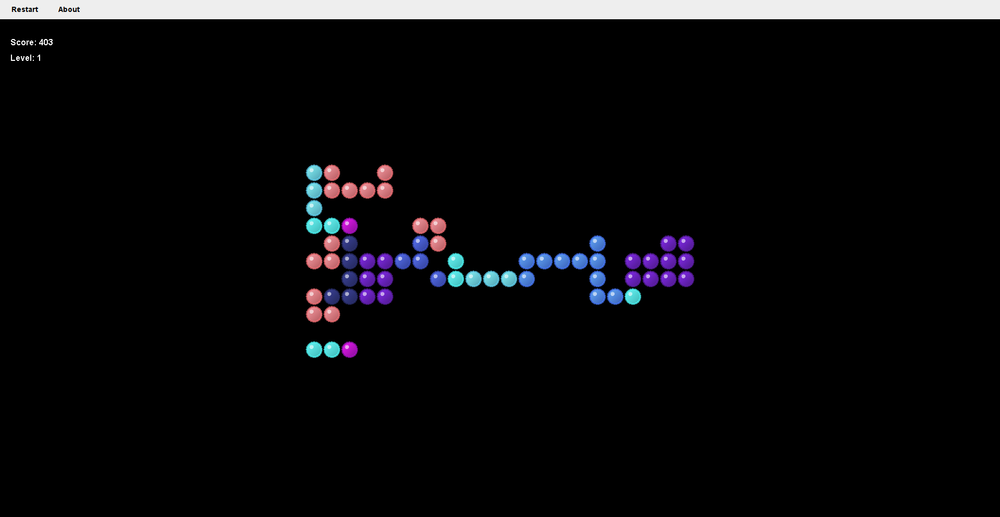

# Bubble Swerve



**Bubble Swerve** is a grid-based falling bubble puzzle game developed in **Java** using **Swing** for the graphical interface. It features orientation-aware logic, rotation mechanics, scoring, and a range of unique "bubbloid" shapes that challenge your spatial thinking and reflexes.

> 🧪 This project is being shared for **code evaluation purposes only**. See [LICENSE](./LICENSE) and [NOTICE](./NOTICE) for details.

---

## 🚀 Features

- Custom rotation system for game pieces  
- Shape variation with orientation-aware behavior  
- Built with plain Java and Swing (no external UI libraries)  
- Modular, object-oriented code structure  
- Maven-compatible build layout  

---

## 🎮 Try It Out

You can try out Bubble Swerve by either:

- **Downloading the latest release:**  
  👉 [Download from the Releases page](https://github.com/scottrodeo/bubble-swerve-java/releases)

- **Cloning the source code and running it locally with Maven:**
  ```bash
  git clone https://github.com/scottrodeo/bubble-swerve-java.git
  cd bubble-swerve-java
  mvn clean compile exec:java -Dexec.mainClass="rodeo.scott.bubbleswerve.Launcher"

- **Or build a runnable JAR file:**

mvn clean package
java -jar target/bubbleswerve-1.0.0.jar

---

## 👀 For the Public, Software Engineers & Evaluators

You are welcome to:

- Read and review the source code
- Run and interact with the game
- Assess code quality, architecture, and design decisions

You **may not** reuse, redistribute, or modify this code outside of evaluation purposes. Please refer to the [LICENSE](./LICENSE) for full terms.

---

## 🔒 Legal

This project is licensed under a **Proprietary Evaluation License**. All rights reserved by [Scott Forsberg](https://github.com/scottrodeo). Unauthorized use is strictly prohibited.

See [NOTICE](./NOTICE) for further legal notes and third-party information (if applicable).

---

## 📬 Contact

Have questions or need clarification?  
Reach out via GitHub: [@scottrodeo](https://github.com/scottrodeo)

